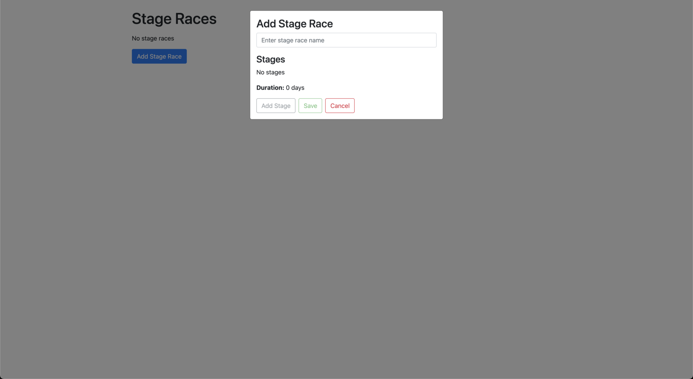
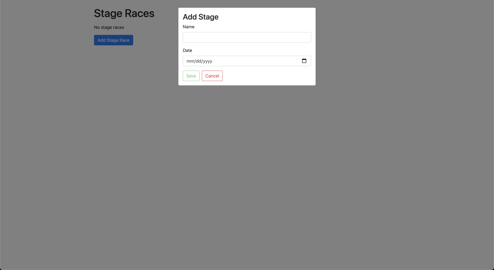
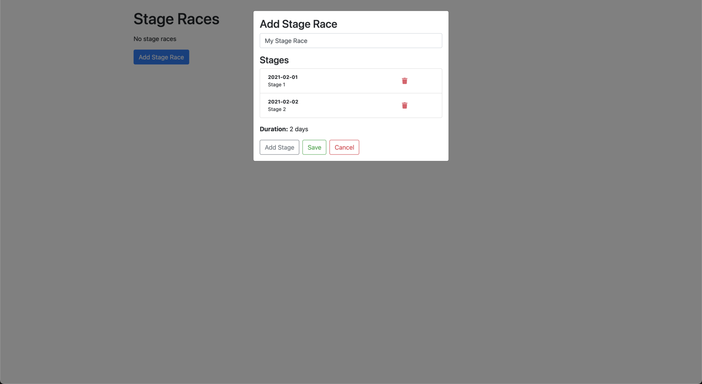

# Add Stage Race

## Requirements

- Clicking "Add Stage Race" button opens the modal.

- Modal "Add Stage Race" form:

  - "Add Stage Race" form renders by default.
  - "Add Stage" button is disabled without a stage race name.
  - "Save" button is disabled without at least one stage.
  - Clicking "Cancel" closes modal.

  

- Modal "Add Stage" form (after entering stage race name and clicking "Add Stage" button):

  - "Add Stage" form renders.
  - "Save" button is disabled without name and date.
  - Clicking "Cancel" returns to "Add Stage Race" form without provisional stage.

  

- Calls `POST "/stage-races"` with stage race data and handles success (after entering stage race name and adding three stages, but deleting one):

  - Stages are reflected in "Add Stage Race" form totals.
  - Stages render on the "Add Stage Race" form ordered oldest to newest.
  - Stages can be deleted.
  - After clicking "Save" button, the modal closes and the added stage race is rendered in the list.

  

- Calls `POST "/stage-races"` with stage race data and handles error (after entering stage race name and adding one stage):

  - Error can be cleared.

  
