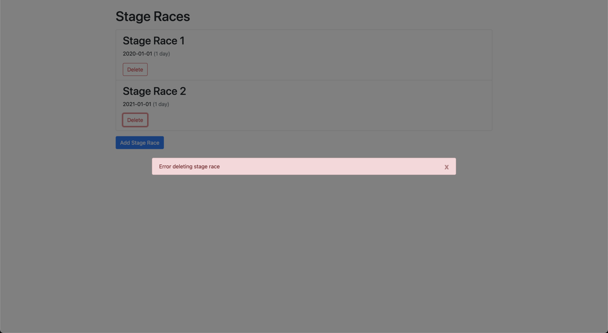

# Delete Stage Race

## Requirements

- Calls `DELETE "/stage-races/{id}"` on "Delete" button click and handles success:

  - Removes deleted stage race from list.

- Calls `DELETE "/stage-races/{id}"` on "Delete" button click and handles error.

  - Stage race for deletion is not removed from list.
  - Error can be cleared.

  
