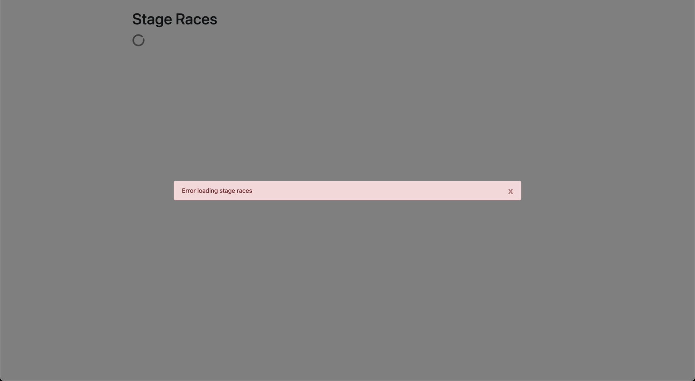

# Stage Races List

## Requirements

- Renders a loading spinner while `GET "/stage-races"` request is in flight.

  

- Renders "No stage races" when `GET "/stage-races"` succeeds without records.

  

- Renders stage races sorted oldest to newest when `GET "/stage-races"` succeeds with records.

  

- Renders "Error loading stage races" when `GET "/stage-races"` errors.

  - Error can be cleared.

  
